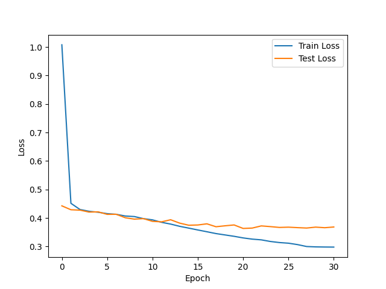
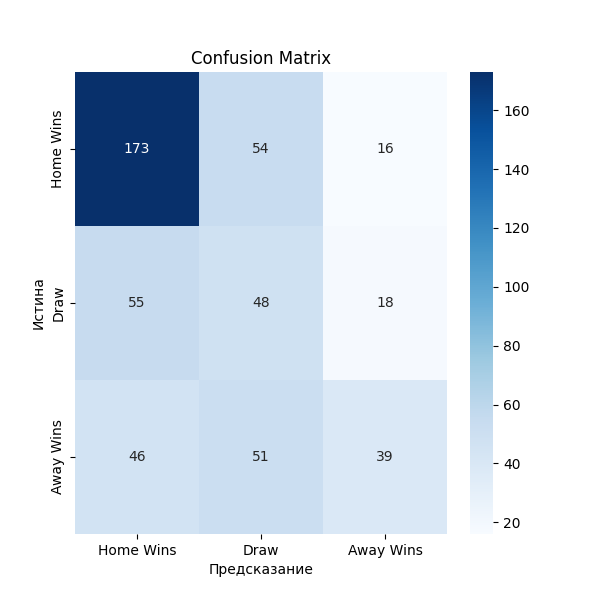
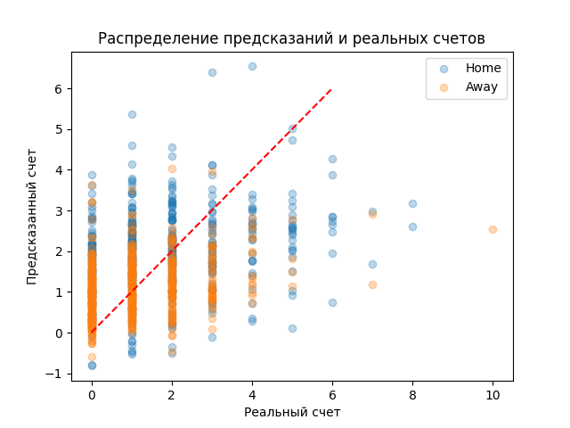
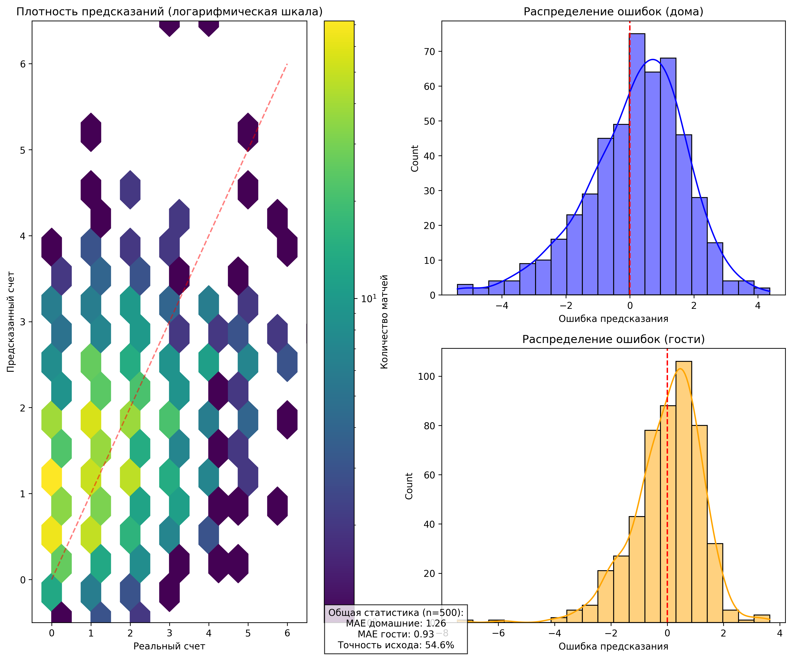
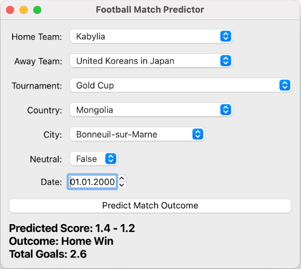

<div align="center">

<h1> ⚽ FootballPrediction</h1>

<p>Прогнозирование результатов футбольных матчей</p>

<p>
  
  
  
  
  
  
  
  
</p>

</div>

## Навигация

* [О проекте](#о-проекте)
* [Структура папок](#структура-папок)
* [Installation](#-installation)
* [Датасет](#-датасет)
  * [Разбиение данных](#разбиение-данных)
  * [Описание датасета](#описание-датасета)
* [Модель](#-модель)
* [Результаты](#-результаты)
* [GUI](#gui)
* [TODO](#todo)

## О проекте

Этот инструмент предназначен для прогнозирования результатов футбольных матчей с использованием глубокого обучения.

Основные возможности:

* Предсказание счета матча на основе исторических данных
* Анализ влияния различных факторов на исход игры
* Графический интерфейс для удобного взаимодействия

## Структура папок

```
football/
├── requirements.txt
├── plots/ - графики обучения
├── data_analysis.ipynb - анализ датасета
├── *cache/ - кэш Dataset (в .gitignore)
├── *weights/ - сохранения весов моделей (в .gitignore)
├── ui/ - Графический интерфейс
│   ├── mappings.py - маппинг датасета для UI
│   └── ui.py - запуск графического интерфейса
└── files/ - файлы проекта
    ├── custom_dataset.py - класс Dataset
    ├── dataset_encode.py - кодирование категориальных признаков
    ├── dataset_load.py - загрузка датасета с kaggle, заполнение пропусков
    ├── models.py - модели
    ├── train.py - старт обучения
    ├── train_utils.py - утилиты для обучения
    └── visualization.py - функции выводы графиков и результатов
```

## 📌 Installation

1. Клонировать репозиторий:

```
git clone https://github.com/fedor81/ML.git
```

2. Создать и активировать `.venv`

```
python -m venv .venv
source ./.venv/bin/activate
```

3. Установить зависимости из `requirements.txt`

```
pip install -r requirements.txt
```

4. Запустить UI:

```
python -m basics-deep-learning-and-AI.football.ui.ui
```

Или тренировать модель:

```sh
python -m basics-deep-learning-and-AI.football.files.train
```

## 📦 Датасет

Для обучения модели был взят датасет с Kaggle: [International football results from 1872 to 2025](https://www.kaggle.com/datasets/martj42/international-football-results-from-1872-to-2017).

### Разбиение данных

* **Тестовые**: последние 500 матчей, сыгранные в 2024-2025 годах.
* **Тренировочные**: 85% от оставшихся
* **Валидационные**: 15%

### Описание датасета

Файл `results.csv` содержит основную информацию о матчах:

* `date` - дата проведения матча
* `home_team` - название домашней команды
* `away_team` - название гостевой команды
* `home_score` - счет домашней команды, включая дополнительное время, не включая пенальти
* `away_score` - счет гостевой команды, включая дополнительное время, не включая пенальти
* `tournament` - название турнира
* `city` - название города, в котором проходил матч
* `country` - название страны, в которой проходил матч
* `neutral` - был ли матч сыгран не нейтральном поле

Файл `shootouts.csv` содержит информацию о пенальти:

* `date` - дата проведения матча
* `home_team` - название домашней команды
* `away_team` - название гостевой команды
* `winner` - победитель серии пенальти
* `first_shooter` - команда, проводившая удар первой

Файл `goalscorers.csv` содержит информацию о забитых голах:

* `date` - дата проведения матча
* `home_team` - название домашней команды
* `away_team` - название гостевой команды
* `team` - название команды, забившей гол
* `scorer` - имя игрока, забившего гол
* `own_goal` - был ли гол забит в свои ворота
* `penalty` - был ли гол забит с пенальти

Файл `former_names.csv` содержит названия использовавшееся командой ранее:

* `current` - название команды, используемое в настоящее время (или последнее название, если команда больше не существует)
* `former` - прежнее название, использовавшееся командой
* `start_date` - дата начала использования прежнего названия
* `end_date` - дата окончания использования прежнего названия

<br/>

*`former_names.csv` никак не использовался, так как в датасете уже используются актуальные названия команд.*

## 🗿 Модель

Модель представляет собой нейронную сеть для предсказания результата футбольного матча(счет home score, away score).

1. **Входные данные**:
   * `match_features`: основные характеристики матча (команды, турнир, город, страна, дата, нейтральная территория) - 9 признаков без счета
   * `home_history`/`away_history`: история последних матчей команд (5 матчей × 11 признаков)
   * `goals_times`: временные метки голов (тензор длины 10)
   * `goals_scorers`: идентификаторы бомбардиров (тензор длины 10)

2. **Обработка признаков**:
   * Категориальные признаки проходят через эмбеддинг-слои с последующей нормализацией
   * История матчей обрабатывается двунаправленным LSTM
   * Временные метки голов обрабатываются сверточной сетью (Conv1d)
   * Данные о бомбардирах обрабатываются механизмом внимания (MultiheadAttention)

3. **Финальное предсказание**:
   * Все обработанные признаки конкатенируются в один вектор
   * Проходят через серию полносвязных слоев
   * На выходе получаем предсказание счета (home_score, away_score)

## 📊 Результаты

В качестве Loss функции использовался Huber.



<br/>

| Model                 | Parameters | Best Epoch | Huber | MAE   | RMSE  | Train Time (Sec) | Eval Time (Sec) |
| --------------------- | ---------- | ---------- | ----- | ----- | ----- | ---------------- | --------------- |
| AdvancedFootballModel | 361378     | 21         | 0.363 | 1.095 | 1.409 | 98.14            | 0.194           |

<br/>

**Модель в большей степени предсказывает победу home-команды.**

<br/>

| Сравнение              | Home Wins | Draw  | Away Wins |
| ---------------------- | --------- | ----- | --------- |
| Истинные значения      | 243       | 121   | 136       |
| Предсказанные значения | 274       | 153   | 73        |
| Precision              | 0.631     | 0.314 | 0.534     |
| Recall                 | 0.712     | 0.397 | 0.288     |
| F1                     | 0.669     | 0.350 | 0.373     |

<br/>

Оказалось довольно странно, что предсказания победы away-команды, могут сильно меняться в зависимости от случайного разбиения данных на тренировочные и валидационные, предпалагаю это потому что я использовал только 15% в качестве валидационных данных.







<br/>

## GUI

<div align="center">
    
</div>

## TODO

* [ ] Учет истории игр в GUI, она формируется в Dataset
* [ ] Отображение городов по странам в GUI
* [ ] Использование локальной копии датасета вместо запросов в Kaggle
* [ ] Доделать механизм кеширования обработанных данных Dataset
* [ ] Добавить новые фичи в модель: статистика перед матчем, пенальти
* [ ] Если мачт уже идет, можно добавить: время от начала матча, счет
* [ ] Сделать количество голов не фиксированным.
* [ ] Не используются фичи own_goal, penalty
