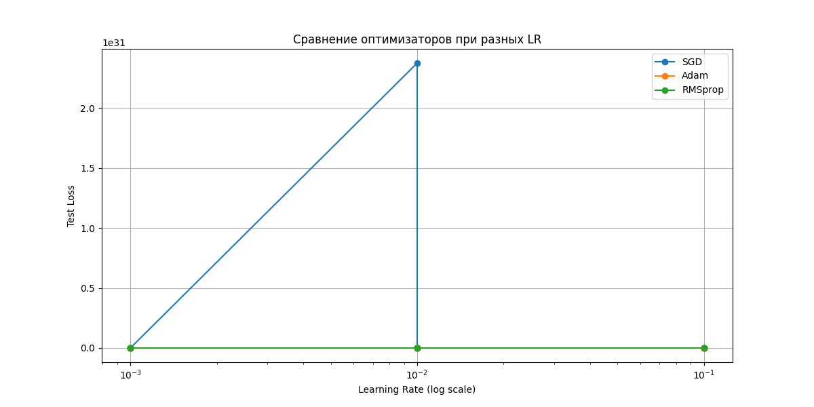
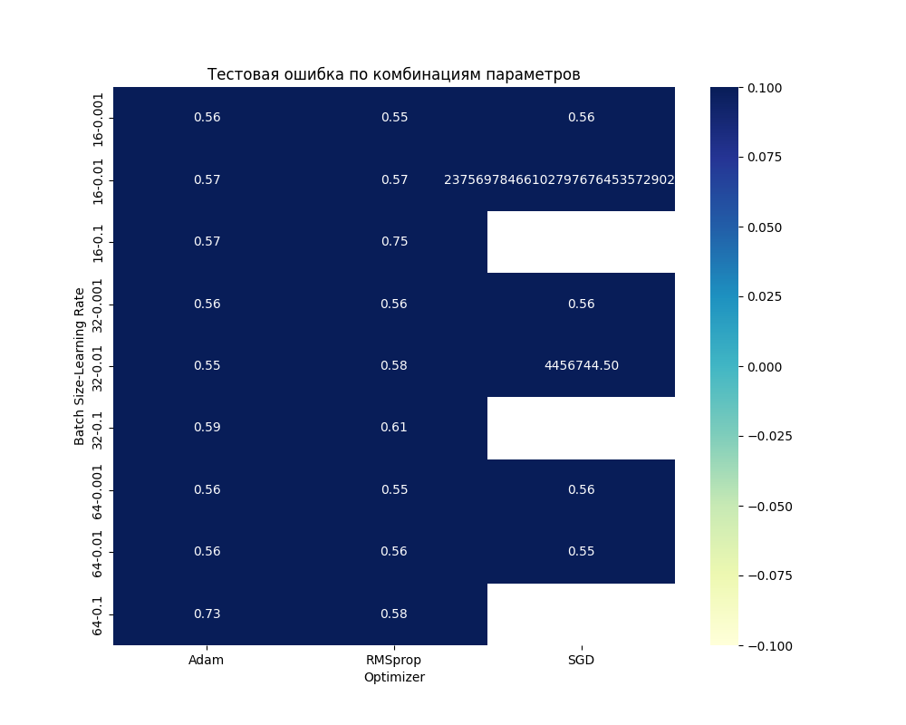

# Линейная и логистическая регрессия

## Цель задания

Закрепить навыки работы с PyTorch API, изучить модификацию моделей и работу с различными датасетами.

## Навигация

- [Задание 1: Модификация существующих моделей](#задание-1-модификация-существующих-моделей)
- [Задание 2: Работа с датасетами](#задание-2-работа-с-датасетами)
- [Задание 3: Эксперименты и анализ](#задание-3-эксперименты-и-анализ)

### Структура проекта

```
homework/
├── homework_model_modification.py
├── homework_datasets.py
├── homework_experiments.py
├── data/                    # Датасеты
├── plots/                   # Графики и визуализации
└── README.md               # Описание решения
```

## Задание 1: Модификация существующих моделей

Создал файл [`homework_model_modification.py`](./homework_model_modification.py)

### 1.1 Расширение линейной регрессии

Модифицируйте существующую линейную регрессию:

- Добавьте L1 и L2 регуляризацию
- Добавьте early stopping

#### Результат

Обучение остановилось на `471` эпохе благодаря early stopping


### 1.2 Расширение логистической регрессии

Модифицируйте существующую логистическую регрессию:

- Добавьте поддержку многоклассовой классификации
- Реализуйте метрики: precision, recall, F1-score, ROC-AUC
- Добавьте визуализацию confusion matrix

#### Результат

Произошли какие то проблемы `Numpy is not available`. Не получалось преобразовать Tensor в массив numpy, не получалось построить красивую таблицу для confusion matrix.

```
Loss: 0.3314
Precision: 0.8224
Recall: 0.8217
F1-Score: 0.8200
Confusion Matrix:
    [81, 23],
    [13, 83]
```

## Задание 2: Работа с датасетами

Создал файл [`homework_datasets.py`](./homework_datasets.py)

### 2.1 Кастомный Dataset класс

Создайте кастомный класс датасета для работы с CSV файлами:

- Загрузка данных из файла
- Предобработка (нормализация, кодирование категорий)
- Поддержка различных форматов данных (категориальные, числовые, бинарные и т.д.)

#### Результат

Можно загружать файлы `.csv` с помощью реализованного класса `CSVDataset()`, но он поддерживает только числовые типы данных.

### 2.2 Эксперименты с различными датасетами

Найдите csv датасеты для регрессии и бинарной классификации и, применяя наработки из предыдущей части задания, обучите линейную и логистическую регрессию

#### Результат

Обучил линейную регрессию на датасете [Walmart_Sales.csv](./data/Walmart_Sales.csv).

```
Epoch 0, Loss: 12471371316.3857
Epoch 10, Loss: 3824.3096
Epoch 20, Loss: 2797.9003
Epoch 30, Loss: 1150.3752
Epoch 40, Loss: 176.7741
Epoch 50, Loss: 81.1451
Epoch 60, Loss: 80.1935
Early stopping at epoch 63
```

## Задание 3: Эксперименты и анализ

Создал файл [`homework_experiments.py`](./homework_experiments.py)

### 3.1 Исследование гиперпараметров

Проведите эксперименты с различными:

- Скоростями обучения (learning rate)
- Размерами батчей
- Оптимизаторами (SGD, Adam, RMSprop)

Визуализируйте результаты в виде графиков или таблиц

#### Результаты

**Топ-5 комбинаций параметров:**

| Learning Rate | Batch Size | Optimizer | Test Loss |
| ------------- | ---------- | --------- | --------- |
| 0.010         | 32         | Adam      | 0.547036  |
| 0.001         | 16         | RMSprop   | 0.548208  |
| 0.010         | 64         | SGD       | 0.553031  |
| 0.001         | 64         | RMSprop   | 0.554802  |
| 0.001         | 64         | SGD       | 0.555068  |







### 3.2 Feature Engineering

Создайте новые признаки для улучшения модели:

- Полиномиальные признаки
- Взаимодействия между признаками
- Статистические признаки (среднее, дисперсия)

Сравните качество с базовой моделью

#### Последнее задание НЕ ВЫПОЛНЕНО
