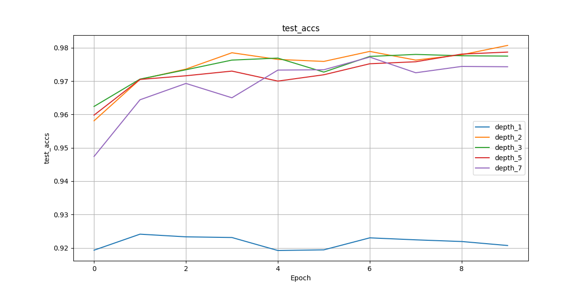

# Домашнее задание к уроку 3: Полносвязные сети

Изучить влияние архитектуры полносвязных сетей на качество классификации, провести эксперименты с различными конфигурациями моделей.

## Навигация

- [Задание 1: Эксперименты с глубиной сети](#задание-1-эксперименты-с-глубиной-сети)
- [Задание 2: Эксперименты с шириной сети](#задание-2-эксперименты-с-шириной-сети)
- [Задание 3: Эксперименты с регуляризацией](#задание-3-эксперименты-с-регуляризацией)

### Структура проекта

```
homework/
├── homework_depth_experiments.py
├── homework_width_experiments.py
├── homework_regularization_experiments.py
├── utils/
│   ├── experiment_utils.py
│   ├── datasets_utils.py
│   ├── visualization_utils.py
│   └── model_utils.py
├── results/
│   ├── depth_experiments/
│   ├── width_experiments/
│   └── regularization_experiments/
├── plots/                   # Графики и визуализации
└── README.md               # Описание результатов
```

## Задание 1: Эксперименты с глубиной сети

Выполнено в фале [`homework_depth_experiments.py`](./homework_depth_experiments.py)

### 1.1 Сравнение моделей разной глубины

Создайте и обучите модели с различным количеством слоев:

- 1 слой (линейный классификатор)
- 2 слоя (1 скрытый)
- 3 слоя (2 скрытых)
- 5 слоев (4 скрытых)
- 7 слоев (6 скрытых)

Для каждого варианта:

- Сравните точность на train и test
- Визуализируйте кривые обучения
- Проанализируйте время обучения

#### Результаты

- На тренировочных данных точность постоянно растет, а на проверочных колеблется.
- Точность выше всего у моделей с количеством слоев от 2 до 5.
- Время обучения увеличивается по мере роста количества слоев, как видно из таблицы.

```
Сравнение моделей:
 Layers  | Train Acc  | Test Acc   | Time (s)  
--------------------------------------------
 1       | 0.9276     | 0.9207     | 107.73
 2       | 0.9938     | 0.9807     | 111.74
 3       | 0.9929     | 0.9775     | 113.11
 5       | 0.9906     | 0.9787     | 120.23
 7       | 0.9885     | 0.9743     | 125.98
```




### 1.2 Анализ переобучения

Исследуйте влияние глубины на переобучение:

- Постройте графики train/test accuracy по эпохам
- Определите оптимальную глубину для каждого датасета
- Добавьте Dropout и BatchNorm, сравните результаты
- Проанализируйте, когда начинается переобучение

#### Результаты

- Использовал нейросеть с семью слоями, но с добавлением `BatchNorm` и `Dropout`.
- Переобучение началось, я предполагаю, с третьей-четвертой эпохи.
- Судя по всем экспериментам в работе, оптимальная глубина для `MNIST` от 2 до 3 слоев, для `CIFAR10` - от 2 до 4.


## Задание 2: Эксперименты с шириной сети

Выполнено в фале [`homework_width_experiments.py`](./homework_width_experiments.py)

### 2.1 Сравнение моделей разной ширины

Создайте модели с различной шириной слоев:

- Узкие слои: [64, 32, 16]
- Средние слои: [256, 128, 64]
- Широкие слои: [1024, 512, 256]
- Очень широкие слои: [2048, 1024, 512]

Для каждого варианта:

- Поддерживайте одинаковую глубину (3 слоя)
- Сравните точность и время обучения
- Проанализируйте количество параметров

#### Результаты

Модели обучались на датасете `CIFAR10`. Точность у моделей с большим количеством нейронов ниже, а время обучения значительно больше.

| Sizes             | Count params | Train Loss | Train Acc | Test Loss | Test Acc | Time (S) |
| ----------------- | ------------ | ---------- | --------- | --------- | -------- | -------- |
| (64, 32, 16)      | 53018        | 0.2668     | 0.9256    | 0.2935    | 0.9166   | 162.5    |
| (256, 128, 64)    | 242762       | 0.2787     | 0.9213    | 0.2821    | 0.9201   | 178.2    |
| (1024, 512, 256)  | 1462538      | 0.2929     | 0.9171    | 0.3035    | 0.9171   | 262.1    |
| (2048, 1024, 512) | 4235786      | 0.2868     | 0.9186    | 0.2953    | 0.9185   | 528.5    |


### 2.2 Оптимизация архитектуры

Найдите оптимальную архитектуру:

- Используйте grid search для поиска лучшей комбинации
- Попробуйте различные схемы изменения ширины (расширение, сужение, постоянная)
- Визуализируйте результаты в виде heatmap

#### Результат

Обучение происходило на датасете `MNIST`.

- Расширяющаяся схема показала себя хуже всего
- Постоянная и сужающаяся схема показали примерно одинаковый результат
- Фаворитом является сужающаяся модель с двумя слоями (512, 256)


- `const_n` - схема со всеми слоями из n нейронов
- `narrow_n` - сужающаяся схема с первым слоем из n нейронов
- `expand_n` - расширяющаяся схема с первым слоем из n нейронов

## Задание 3: Эксперименты с регуляризацией

Выполнено в фале [`homework_regularization_experiments.py`](./homework_regularization_experiments.py)

### 3.1 Сравнение техник регуляризации

Исследуйте различные техники регуляризации:

- Без регуляризации
- Только Dropout (разные коэффициенты: 0.1, 0.3, 0.5)
- Только BatchNorm
- Dropout + BatchNorm
- L2 регуляризация (weight decay)

Для каждого варианта:

- Используйте одинаковую архитектуру
- Сравните финальную точность
- Проанализируйте стабильность обучения
- Визуализируйте распределение весов

#### Результаты

Использовалась одинаковая архитектура: два слоя по 128 нейронов.  
График для `l2` значительно отличается от остальных, но его обучение кажется не таким стабильным. У всех моделей веса находятся в пределах `0.01`, у l2-регуляризации они выше в 13 раз, но и точность больше.

```
Сравнение техник регуляризации:

Regularization  | Accuracy | Weight Mean  | Weight Std
-------------------------------------------------------
none            | 0.1071   | 0.010530    | 0.014692
dropout_0.1     | 0.1101   | 0.010528    | 0.014657
dropout_0.3     | 0.1128   | 0.010505    | 0.014639
dropout_0.5     | 0.0904   | 0.010523    | 0.014677
batchnorm       | 0.0987   | 0.010535    | 0.014685
both            | 0.1011   | 0.010522    | 0.014681
l2              | 0.3473   | 0.134244    | 0.176026
```


### 3.2 Адаптивная регуляризация

Реализуйте адаптивные техники:

- Dropout с изменяющимся коэффициентом
- BatchNorm с различными momentum
- Комбинирование нескольких техник
- Анализ влияния на разные слои сети

#### Результаты

Для задания 3 модели обучались на `CIFAR10`

Использовались модели с тремя слоями по 128 нейронов.

Dropout уменьшающийся 0.5, 0.3, 0.1, momentum увеличивающийся: 0.1, 0.3, 0.5.

```
Сравнение техник регуляризации:

Regularization     | Accuracy | Weight Mean | Weight Std
--------------------------------------------------------
dropout_adaptive   | 0.0813   | 0.011826    | 0.017531
batchnorm_adaptive | 0.0905   | 0.011799    | 0.017490
combined           | 0.1023   | 0.011817    | 0.017523
```

**Лучший вариант**: комбинировать техники.

`dropout_adaptive` - Остановился с помощью Early Stopping.


