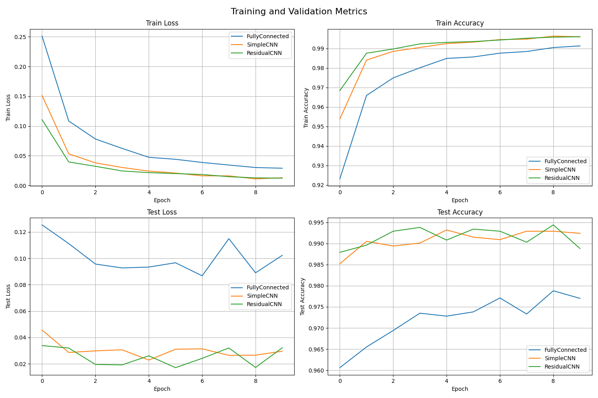
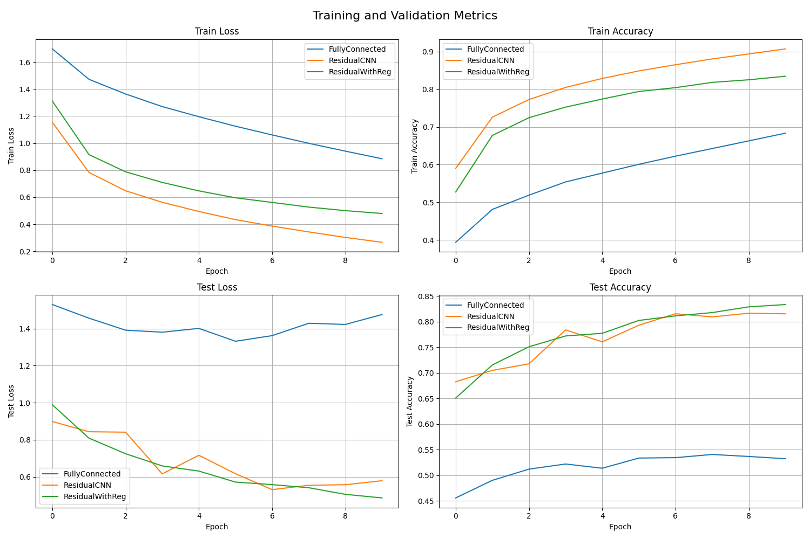
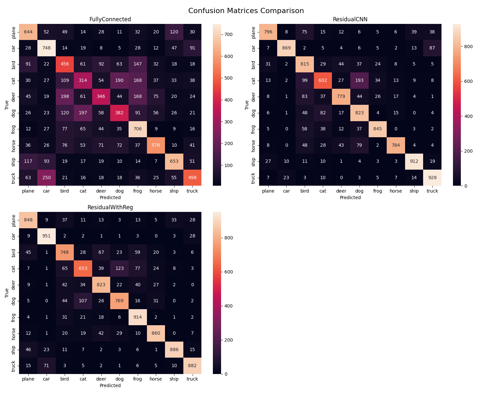
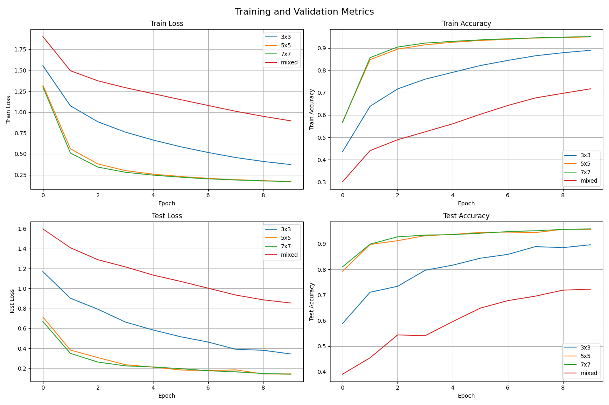
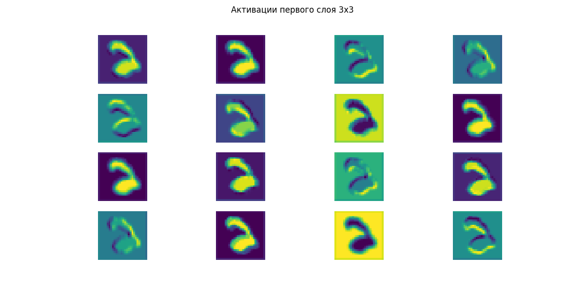
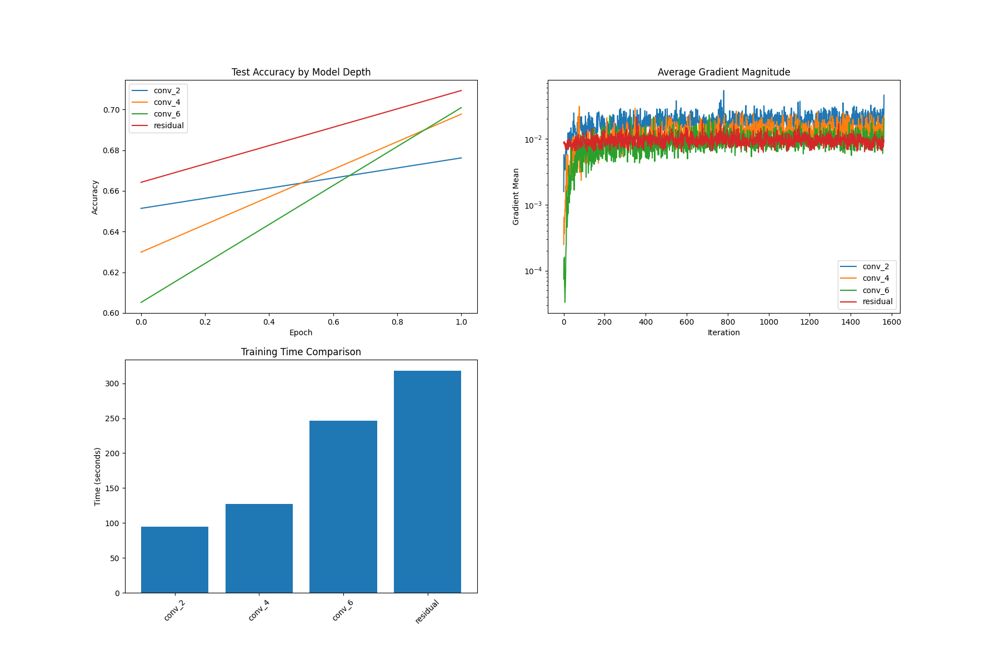
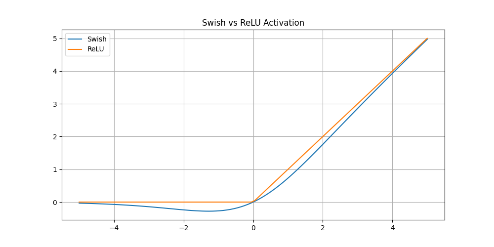
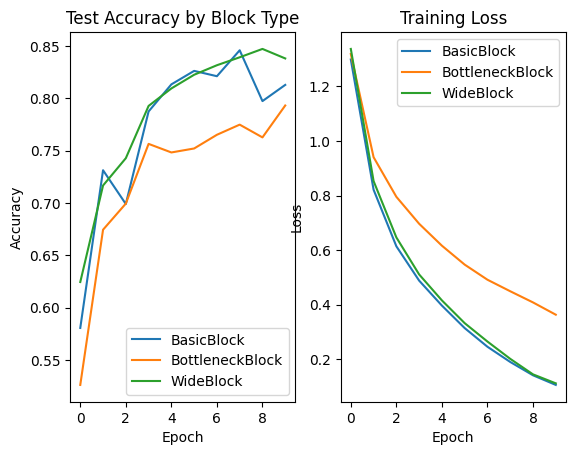

# Домашнее задание к уроку 4: Сверточные сети

Сравнить эффективность сверточных и полносвязных сетей на задачах компьютерного зрения, изучить преимущества CNN архитектур.

## Навигация

- [Задание 1: Сравнение CNN и полносвязных сетей](#задание-1-сравнение-cnn-и-полносвязных-сетей)
- [Задание 2: Анализ архитектур CNN](#задание-2-анализ-архитектур-cnn)
- [Задание 3: Кастомные слои и эксперименты](#задание-3-кастомные-слои-и-эксперименты)

## Структура проекта

```
homework/
├── homework_cnn_vs_fc_comparison.py
├── homework_cnn_architecture_analysis.py
├── homework_custom_layers_experiments.py
├── models/
│   ├── cnn_models.py
│   └── custom_layers.py
├── utils/
│   ├── comparison_utils.py
│   ├── visualization_utils.py
│   └── training_utils.py
├── results/
│   ├── mnist_comparison/
│   ├── cifar_comparison/
│   └── architecture_analysis/
├── plots/                   # Графики и визуализации
└── README.md               # Описание результатов
```

## Задание 1: Сравнение CNN и полносвязных сетей

Сделано в файле [`homework_cnn_vs_fc_comparison.py`](./homework_cnn_vs_fc_comparison.py)

### 1.1 Сравнение на MNIST

Сравните производительность на MNIST:

- Полносвязная сеть (3-4 слоя)
- Простая CNN (2-3 conv слоя)
- CNN с Residual Block

Для каждого варианта:

- Обучите модель с одинаковыми гиперпараметрами
- Сравните точность на train и test множествах
- Измерьте время обучения и инференса
- Визуализируйте кривые обучения
- Проанализируйте количество параметров

#### Ход эксперимента

Создал три модели: полносвязную `FullyConnected` со слоями (128, 128, 128), `SimpleCNN` и `CNNWithResidual` с занятия.

Обучил их в течение 10-ти эпох на датасете `MNIST`.

#### Результаты

| Model          | Train Loss | Train Acc | Test Loss | Test Acc | Train Time (s) | Inference Time (s) | Count Params |
| -------------- | ---------- | --------- | --------- | -------- | -------------- | ------------------ | ------------ |
| FullyConnected | 0.0290     | 0.9913    | 0.0868    | 0.9788   | 109.5710       | 1.4034             | 134794       |
| SimpleCNN      | 0.0110     | 0.9963    | 0.0228    | 0.9932   | 326.9298       | 2.6275             | 421642       |
| ResidualCNN    | 0.0123     | 0.9960    | 0.0171    | 0.9944   | 1442.9904      | 6.8138             | 160906       |

<br/>



### 1.2 Сравнение на CIFAR-10

Сравните производительность на CIFAR-10:

- Полносвязная сеть (глубокая)
- CNN с Residual блоками
- CNN с регуляризацией и Residual блоками

Для каждого варианта:

- Обучите модель с одинаковыми гиперпараметрами
- Сравните точность и время обучения
- Проанализируйте переобучение
- Визуализируйте confusion matrix
- Исследуйте градиенты (gradient flow)

#### Ход эксперимента

Взял модели из предыдущего эксперимента, но полносвязная `FullyConnected` со слоями (512, 256, 128, 64), так как в предыдущей лабораторной работе я выяснил что сужающаяся архитектура работает лучше.

Тренировал их в течении 10-ти эпох, на датасете `CIFAR10`.

#### Результаты

- Время обучения полносвязнной сети меньше примерно в 10 раз
- Но сверточные модели показывают большую точность
- Полносвязная модель начала переобучаться на 5-й эпохе, Residual - на 6-й, ResidualWithRegularization - мне кажется еще не начала переобучаться

<br/>

| Model           | Train Loss | Train Acc | Test Loss | Test Acc | Train Time (s) | Infer Time (s) | Count Params |
| --------------- | ---------- | --------- | --------- | -------- | -------------- | -------------- | ------------ |
| FullyConnected  | 0.8844     | 0.6835    | 1.3313    | 0.5408   | 172.7339       | 1.6474         | 1746506      |
| ResidualCNN     | 0.2665     | 0.9069    | 0.5308    | 0.8165   | 1540.8055      | 9.0995         | 161482       |
| ResidualWithReg | 0.4796     | 0.8345    | 0.4860    | 0.8334   | 1663.6815      | 9.1218         | 161482       |

<br/>





## Задание 2: Анализ архитектур CNN

Выполнено в файле [`homework_cnn_architecture_analysis.py`](./homework_cnn_architecture_analysis.py)

### 2.1 Влияние размера ядра свертки

Исследуйте влияние размера ядра свертки:

- 3x3 ядра
- 5x5 ядра
- 7x7 ядра
- Комбинация разных размеров (1x1 + 3x3)

Для каждого варианта:

- Поддерживайте одинаковое количество параметров
- Сравните точность и время обучения
- Проанализируйте рецептивные поля
- Визуализируйте активации первого слоя

#### Ход эксперимента

Сделал модель с двумя Conv слоями, в которой можно задавать размер ядра при инициализации - `KernelizableCNN`.

Используя размеры ядер указанные в задании, обучил четыре модели в течение 10-ти эпох на датасете `MNIST`.

#### Результаты

- Эти модели тренировал в Google Colab на GPU, поэтому у них меньше время обучения чем в экспериментах до этого.
- Модели с большим размером kernel показывают лучшие результаты.

<br/>

| Model | Train Loss | Train Acc | Test Loss | Test Acc | Train Time (s) | Infer Time (s) | Рецептивное поле |
| ----- | ---------- | --------- | --------- | -------- | -------------- | -------------- | ---------------- |
| 3x3   | 0.3716     | 0.8898    | 0.3439    | 0.8961   | 197.2093       | 2.1884         | 5                |
| 5x5   | 0.1702     | 0.9499    | 0.1437    | 0.9565   | 171.5778       | 2.0361         | 9                |
| 7x7   | 0.1663     | 0.9513    | 0.1418    | 0.9579   | 178.7057       | 2.0349         | 13               |
| mixed | 0.8948     | 0.7172    | 0.8549    | 0.7227   | 181.4757       | 2.1076         | 3                |

<br/>





### 2.2 Влияние глубины CNN

Исследуйте влияние глубины CNN:

- Неглубокая CNN (2 conv слоя)
- Средняя CNN (4 conv слоя)
- Глубокая CNN (6+ conv слоев)
- CNN с Residual связями

Для каждого варианта:

- Сравните точность и время обучения
- Проанализируйте vanishing/exploding gradients
- Исследуйте эффективность Residual связей
- Визуализируйте feature maps

#### Ход эксперимента

Создал три модели с количеством Conv-слоев: 2, 4, 6 - и одну `CNNWithResidual` с практики.

Собирался обучить их в течение 10-ти эпох, на датасете `CIFAR10`, но возникли трудности, описанные ниже.

#### Результат

**Задание не готово** по причине *неэффективного использования оперативной памяти*. Чтобы исправить проблему следует сразу же после обучения модели очищать оперативную память: либо строить график и выводить статистику, либо сохранять все на диск, а после обучения всех моделей доставать и визуализировать.

В текущей реализации программа использует не менее 45ГБ оперативной памяти, я проводил обучение **в течение двух эпох**. Теперь мне понятно чем обусловлена столь медленная скорость обучения во всех моих экспериментах.

- Первая модель с двумя conv слоями обучилась быстро, так как ей было достаточно выделенной оперативной памяти. Другие модели обучались медленней, а с увеличением количества слоев время тем более.

```
Сравнение моделей:

Model     | Test Acc | Time (s) | Grad Mean | Grad Min/Max
---------------------------------------------------------------
conv_2    | 0.6762   | 94.40    | 1.83e-02  | 2.20e-05/1.64e-01
conv_4    | 0.6977   | 127.01   | 1.20e-02  | 1.39e-05/1.04e-01
conv_6    | 0.7009   | 246.36   | 9.00e-03  | 9.56e-06/9.79e-02
residual  | 0.7093   | 317.99   | 9.54e-03  | 1.05e-04/6.36e-02
```




## Задание 3: Кастомные слои и эксперименты

Выполнено в файле [`homework_custom_layers_experiments.py`](./homework_custom_layers_experiments.py)

### 3.1 Реализация кастомных слоев

Реализуйте кастомные слои:

- Кастомный сверточный слой с дополнительной логикой
- Attention механизм для CNN
- Кастомная функция активации
- Кастомный pooling слой

Для каждого слоя:

- Реализуйте forward и backward проходы
- Добавьте параметры если необходимо
- Протестируйте на простых примерах
- Сравните с стандартными аналогами

#### Ход эксперимента

- Реализовал сверточный слой с L1 регуляризацией `L1Conv2d`, сравнил его время работы с `torch.nn.Conv2d`
- Реализовал Attention механизм
- Сделал `StochasticPool`, сравнил его с `torch.nn.MaxPool2d`
- Сделал функцию активации `Swish`

#### Результаты

##### Сверточный слой

- Добавляет L1 регуляризацию backward
- Дает более разреженные веса

```
Время работы:

Standard Conv: 0.3202s
L1 Conv: 0.3630s
```

##### StochasticPool

```python
x = torch.randn(32, 64, 128, 128)

MaxPool: 0.0503s
StochasticPool: 1.0846s

MaxPool output shape: torch.Size([32, 64, 64, 64])
StochasticPool output shape: torch.Size([32, 64, 64, 64])

MaxPool output range: -2.2704 5.6625
StochasticPool output range: -3.1822 5.5130
```

##### Функция активации Swish



### 3.2 Эксперименты с Residual блоками

Исследуйте различные варианты Residual блоков:

- Базовый Residual блок
- Bottleneck Residual блок
- Wide Residual блок

Для каждого варианта:

- Реализуйте блок с нуля
- Сравните производительность
- Проанализируйте количество параметров
- Исследуйте стабильность обучения

#### Ход эксперимента

Создал модель с тремя сменными Residual блоками, и указанные типы блоков. Обучил их на датасете `CIFAR10` в течение 10-ти эпох.

#### Результаты

- Наибольшее количество параметров у WideBlock, как и время обучения и инференса
- BottleneckBlock с самым меньшим числом параметров обучается и работает быстрее
- BasicBlock обучается наименее стабильно

<br/>

| Model           | Train Loss | Train Acc | Test Loss | Test Acc | Train Time (s) | Infer Time (s) | Count Params |
| --------------- | ---------- | --------- | --------- | -------- | -------------- | -------------- | ------------ |
| BasicBlock      | 0.1052     | 0.9639    | 0.5131    | 0.8460   | 324.2372       | 3.0271         | 2777674      |
| BottleneckBlock | 0.3628     | 0.8725    | 0.6308    | 0.7932   | 218.4723       | 2.8173         | 221386       |
| WideBlock       | 0.1110     | 0.9604    | 0.5185    | 0.8473   | 499.9500       | 3.3507         | 5507402      |

<br/>

