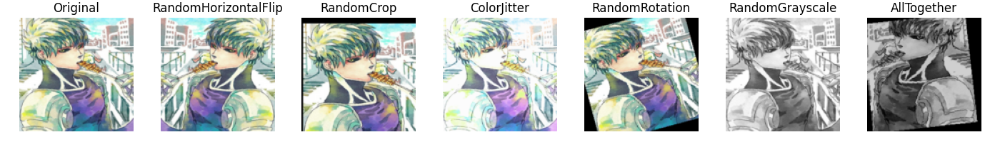

# Домашнее задание к уроку 5: Аугментации и работа с изображениями

## Навигация

- [Задание 1: Стандартные аугментации torchvision](#задание-1-стандартные-аугментации-torchvision)
- [Задание 2: Кастомные аугментации](#задание-2-кастомные-аугментации)
- [Задание 3: Анализ датасета](#задание-3-анализ-датасета)
- [Задание 4: Pipeline аугментаций](#задание-4-pipeline-аугментаций)
- [Задание 5: Эксперимент с размерами](#задание-5-эксперимент-с-размерами)
- [Задание 6: Дообучение предобученных моделей](#задание-6-дообучение-предобученных-моделей)

### Структура папок

```
task5/
├── data/ - изображения героев
│   ├── train/
│   │   ├── hero1/
│   │   │   ├── image1.jpg
│   │   │   └── ...
│   │   ├── hero2/
│   │   │   └── ...
│   │   └── ...
│   ├── val/
│   │   └── ...
│   └── test/
│       └── ...
├── results/ - результаты выполнения
├── utils/
│   ├── datasets.py
│   ├── extra_augs.py
│   └── visualization.py
└── solutions/ - решения задач
    ├── standard_augmentations.py
    ├── custom_augmentations.py
    ├── dataset_analysis.py
    ├── pipeline_augmentations.py
    ├── sizes_experiment.py
    └── post_training.py
```

### Датасет

Скачать [по ссылке](https://drive.google.com/drive/folders/1_MSGk6YnnRwU0ckLQbkYHNgyeKxz_r57?usp=drive_link) и распаковать в указанной выше директории.

## Задание 1: Стандартные аугментации torchvision

Выполнено в файле [`standard_augmentations.py`](./solutions/standard_augmentations.py)

1. Создайте пайплайн стандартных аугментаций torchvision (например, RandomHorizontalFlip, RandomCrop, ColorJitter, RandomRotation, RandomGrayscale).
2. Примените аугментации к 5 изображениям из разных классов (папка train).
3. Визуализируйте:
   - Оригинал
   - Результат применения каждой аугментации отдельно
   - Результат применения всех аугментаций вместе

### Ход работы

1. Создал `CustomImageDataset`, загрузил по одному изображению от каждого класса.
2. В цикле for применил к ним аугументации, сначала по одной, потом все вместе.
3. Отобразил с помощью `show_multiple_augmentations()`

### Результаты





## Задание 2: Кастомные аугментации

Выполнено в файле [`custom_augmentations.py`](./solutions/custom_augmentations.py)

1. Реализуйте минимум 3 кастомные аугментации (например, случайное размытие, случайная перспектива, случайная яркость/контрастность).
2. Примените их к изображениям из train.
3. Сравните визуально с готовыми аугментациями из extra_augs.py.

### Реализовано

- Случайное размытие движения - `CustomMotionBlur`
- Случайное перспективное преобразование - `CustomRandomPerspective`
- Случайная яркость и контраст `CustomRandomBrightnessContrast`

### Результаты

Сравнение проводится с аугментациями из `extra_augs.py`.


## Задание 3: Анализ датасета

Выполнено в файле [`dataset_analysis.py`](./solutions/dataset_analysis.py)

1. Подсчитайте количество изображений в каждом классе.
2. Найдите минимальный, максимальный и средний размеры изображений.
3. Визуализируйте распределение размеров и гистограмму по классам.

### Ход решения

Создал `CustomImageDataset`, прошелся по нему в цикле for, сохраняя размеры изображений и увеличивая счетчик соответствующего класса.

### Результаты

```
Количество изображений в ./basics-deep-learning-and-AI/homework/task5/data/train:

+-------+-------+---------+-------+-----------+--------+
| Гароу | Генос | Сайтама | Соник | Татсумаки | Фубуки |
+-------+-------+---------+-------+-----------+--------+
|   30  |   30  |    30   |   30  |     30    |   30   |
+-------+-------+---------+-------+-----------+--------+

Общая статистика по размерам:

Всего изображений: 180
Минимальный размер: 224x224
Максимальный размер: 224x224
Средний размер: 224x224
```


## Задание 4: Pipeline аугментаций

Выполнено в файле [`pipeline_augmentations.py`](./solutions/pipeline_augmentations.py)

1. Реализуйте класс AugmentationPipeline с методами:
   - add_augmentation(name, aug)
   - remove_augmentation(name)
   - apply(image)
   - get_augmentations()
2. Создайте несколько конфигураций (light, medium, heavy).
3. Примените каждую конфигурацию к train и сохраните результаты.

### Ход выполнения

Написал pipeline, добавил три функции создающие light, medium и heavy pipelines.

- Light применяет небольшие флипы, изменения цвета и размытие
- Medium - флипы, повороты, изменения цвета, оттенки серого
- Heavy применяет все указанное и еще несколько трансформов

### Результаты

Применение pipeline: light, medium и heavy


## Задание 5: Эксперимент с размерами

Выполнено в файле [`sizes_experiment.py`](./solutions/sizes_experiment.py)

1. Проведите эксперимент с разными размерами изображений (например, 64x64, 128x128, 224x224, 512x512).
2. Для каждого размера измерьте время загрузки и применения аугментаций к 100 изображениям, а также потребление памяти.
3. Постройте графики зависимости времени и памяти от размера.

### Ход эксперимента

1. Для каждого размера создавал `CustomImageDataset` и загружал с помощью него 100 фотографий, засекал время.
2. Для загруженных фотографий применял аугментации: RandomHorizontalFlip, GaussianBlur, RandomPosterize - и засекал время.
3. После каждого этапа измерял память.

### Результаты

```
Загрузка и применение аугментаций к 100 изображениям:

+-----------+-----------+--------------------+--------------+
|    Size   | Load time | Augmentations time | Memory usage |
+-----------+-----------+--------------------+--------------+
|   32x32   |    0.75   |        0.06        |    10.72     |
|   64x64   |    0.71   |        0.06        |     0.59     |
|  128x128  |    0.78   |        0.09        |     5.89     |
|  224x224  |    0.85   |        0.18        |    33.41     |
|  512x512  |    1.18   |        1.72        |    131.27    |
| 1024x1024 |    2.13   |        7.49        |    476.96    |
+-----------+-----------+--------------------+--------------+
```


## Задание 6: Дообучение предобученных моделей

Выполнено в файле [`post_training.py`](./solutions/post_training.py)

1. Возьмите одну из предобученных моделей torchvision (например, resnet18, efficientnet_b0, mobilenet_v3_small).
2. Замените последний слой на количество классов вашего датасета.
3. Дообучите модель на train, проверьте качество на val.
4. Визуализируйте процесс обучения (loss/accuracy).

### Ход работы

Обучил resnet18 на тренировочном датасете с применением аугментаций, проверял на тестовом датасете без аугментаций.

### Результат

Early stopping at epoch 43.

|  Model   | Train Loss | Train Acc | Test Loss | Test Acc | Train Time (s) | Infer Time (s) | Count Params |
|----------|------------|-----------|-----------|----------|----------------|----------------|--------------|
| resnet18 |   0.0031   |   1.0000  |   0.8314  |  0.7017  |    160.3802    |     7.1055     |   11179590   |

<br/>


